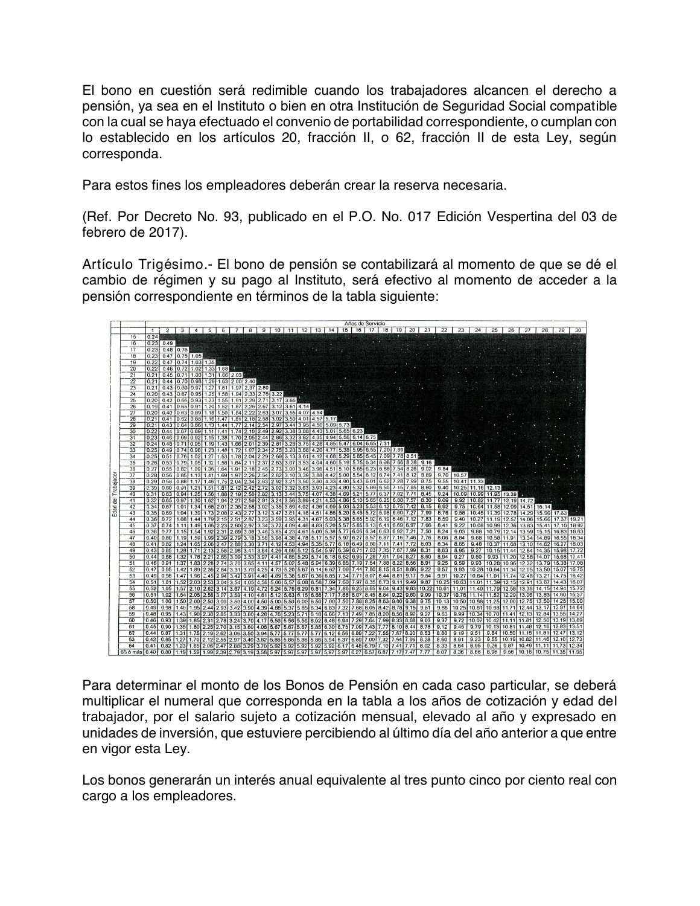

# Ley de Pensiones

> AVISO: La tabla del artículo transitorio Trigésimo, página 36, se conserva como imagen, no como datos de texto. Para consultar sus valores, adjunte también el PDF original. No calcular bonos de pensión sólo con el texto extraído.

> Transcripción del original del Congreso. Consulta metadata.json y validacion.json.

<!-- PAGINA_PDF: 1 -->

TEXTO VIGENTE

Última reforma publicada en el P.O. No. 146, Primera Sección, del 04 de diciembre de 2020.

DECRETO NÚMERO: 314*

LEY DE PENSIONES PARA EL ESTADO DE SINALOA

## TÍTULO PRIMERO

DISPOSICIONES GENERALES

## CAPÍTULO ÚNICO

### Artículo 1.-

Las disposiciones de la presente ley son de orden administrativo, público y de interés social, obligatoria y de observancia general para los tres poderes del Gobierno del Estado, los órganos autónomos constitucionales del Estado de Sinaloa, los organismos descentralizados del Estado y los que por leyes, decretos, reglamentos o convenios lleguen a establecer su aplicación, que en lo sucesivo se identificarán como empleadores, así como para los trabajadores de los mismos.

### Artículo 2.-

El sistema de pensiones previsto en esta Ley, tiene por finalidad la protección de los medios de subsistencia y el otorgamiento de pensiones y jubilaciones, previo cumplimiento de los requisitos que en ella se establecen.

### Artículo 3.-

Para los efectos de esta Ley, se entiende por:

I. Años de cotización: El total de la suma de tiempo efectivamente cotizado al Instituto, que puede diferir de los años de servicio;

II. Años de servicio: El periodo declarado por los empleadores como laborado por sus trabajadores y reconocido por el Instituto;

III. Aportaciones: El monto que deben cubrir al Instituto los empleadores, equivalente a un porcentaje determinado del salario sujeto a cotización;

IV. Beneficiario: La persona a quien se extienden los derechos en el goce de los beneficios y servicios que otorga el Instituto por razones de parentesco y dependencia económica en su caso, con el trabajador o pensionado;

V. Cuenta Individual: La que se constituye a favor del trabajador, para que se registren las aportaciones, cuotas, rendimientos, y cualquier otra cantidad que tenga derecho a recibir para el pago de su pensión;

* Publicado en el P.O. “El Estado de Sinaloa” No. 038 Segunda Sección el 30 de marzo de 2009.

<!-- PAGINA_PDF: 2 -->

VI. Cuotas: El monto que debe cubrir al Instituto el trabajador, equivalente a un porcentaje determinado de su salario sujeto a cotización;

VII. Director General: El Director General del Instituto de Pensiones del Estado de Sinaloa.

VIII. Empleadores: Los Poderes del Estado, órganos autónomos constitucionales del Estado de Sinaloa, los organismos descentralizados del Estado y aquellos que celebren convenios de incorporación para que los trabajadores adscritos a estos, gocen de los beneficios que prevé este ordenamiento;

IX. Instituto: El Instituto de Pensiones del Estado de Sinaloa;

X. Ley: La Ley de Pensiones para el Estado de Sinaloa;

XI. Pensión de Sobrevivencia: La que contrata con el Instituto el pensionado que reciba la renta vitalicia a favor de sus beneficiarios, para otorgarles a éstos la pensión que corresponda, en caso de fallecimiento de éste. La contratación es al mismo tiempo que la renta vitalicia;

XII. Pensión mínima garantizada: La equivalente mensualmente a sesenta salarios mínimos diarios vigentes en la Entidad y que el Instituto garantiza a los trabajadores sujetos al régimen obligatorio, siempre y cuando reúnan los requisitos para obtener una pensión por jubilación y que los fondos de la respectiva cuenta individual no sean suficientes para acceder a una renta vitalicia mensual igual o mayor a la pensión mínima garantizada;

XIII. Pensión: La prestación en dinero que se otorga al pensionado o, en su caso, al beneficiario;

XIV. Pensionado: El trabajador o sus beneficiarios, que adquieran una pensión, en los términos de esta Ley;

XV. Renta vitalicia: La cantidad mensual que reciba el pensionado considerando la pensión de sobrevivencia y la gratificación anual, mediante el contrato que celebre con el Instituto; el cálculo del pago mensual de la renta vitalicia se realizará considerando la esperanza de vida del pensionado y de los beneficiarios en su caso, así como los rendimientos previsibles del saldo de la cuenta individual;

XVI. Salario Regulador: El promedio de los salarios sujetos a cotización de toda la vida activa del trabajador, previa actualización, considerando el Índice Nacional de Precios al Consumidor;

<!-- PAGINA_PDF: 3 -->

XVII. Salario sujeto a cotización: El que se integra con el total de las percepciones que en forma regular y con una periodicidad no mayor a un mes, reciban los trabajadores; y,

XVIII. Trabajador: La persona física que presta un servicio personal subordinado, mediante el pago de un salario, a cualquiera de los empleadores y que se encuentre inscrito como tal ante el Instituto.

### Artículo 4.-

Los derechohabientes para recibir o, en su caso, seguir disfrutando de las prestaciones que esta Ley otorga, deberán cumplir con los requisitos establecidos en la misma. Para tal efecto, el Instituto expedirá a todos los derechohabientes, un documento de identificación con fotografía a fin de que puedan ejercer los derechos que la Ley les confiere, según el caso.

### Artículo 5.-

Las prestaciones que corresponden a los trabajadores y a sus beneficiarios son inembargables. Sólo en los casos de obligaciones alimenticias a su cargo, pueden embargarse por la autoridad judicial hasta por el cincuenta por ciento del importe que les corresponda.

### Artículo 6.-

Los casos no previstos en la presente Ley, se resolverán aplicando supletoriamente y en su orden:

I. La Constitución Política de los Estados Unidos Mexicanos;

II. La Ley Federal del Trabajo;

III. La jurisprudencia;

IV. La Constitución Política del Estado de Sinaloa;

V. La Ley de los Trabajadores al Servicio del Estado de Sinaloa;

VI. Los principios generales de derecho;

VII. La costumbre; y,

VIII. La equidad.

## TÍTULO SEGUNDO

RÉGIMEN FINANCIERO

## CAPÍTULO ÚNICO

### Artículo 7.-

Los empleadores, aportarán mensualmente al Instituto el diez por ciento del salario sujeto a cotización de los trabajadores, distribuido de la siguiente manera:

<!-- PAGINA_PDF: 4 -->

a). 5.175% para cuenta individual. b). 2.075% para invalidez y vida. c). 1% para administración. d). 1% para pensión mínima garantizada. e). 0.75% para pensiones de incapacidad y muerte por riesgo de trabajo.

Adicionalmente, los empleadores aportarán mensualmente una cantidad equivalente al 5.5% del salario mínimo general vigente en el Estado de Sinaloa, elevado al mes, a la cuenta individual de cada trabajador.

### Artículo 8.-

Los empleadores tendrán la obligación de presentar por sus trabajadores los siguientes avisos:

I. De afiliación, que deberá contener los siguientes datos:

a). Nombre completo del trabajador; b). Fecha y lugar de nacimiento; c). Categoría que desempeña; d). Dependencia de adscripción; e). Domicilio actual; f). Fecha de ingreso al trabajo; g). Salario sujeto a cotización; h). Número de Clave Única de Registro Poblacional; i). Registro Federal de Contribuyente; y, j). Nombres completos, parentesco, lugar y fecha de nacimiento de sus beneficiarios.

II. De baja, que contendrán como mínimo los siguientes datos:

a). Nombre del trabajador; b). Fecha y motivo de terminación de la relación laboral; c). Dependencia de adscripción; d). Número de inscripción ante el Instituto; y, e). Registro Federal de Contribuyentes.

III. De modificación de salarios, con los siguientes datos mínimos:

a). Nombre completo del trabajador; b). Fecha de modificación de salario; c). Importe del nuevo salario sujeto a cotización; d). Número de inscripción ante el Instituto; y, e). Registro Federal de Contribuyentes.

El Instituto aprobará los formatos de los avisos a que se refiere este artículo, de los cuales el trabajador recibirá una copia en cada caso. Los avisos contendrán los datos generales de sus empleadores debiendo ser presentados ante el Instituto dentro de los cinco días siguientes a la fecha en que ocurran.

<!-- PAGINA_PDF: 5 -->

### Artículo 9.-

Las cuotas se calcularán mensualmente en función de los días trabajados.

### Artículo 10.-

Los trabajadores aportarán el diez punto seiscientos veinticinco por ciento del salario sujeto a cotización, el cual les será descontado en la nómina y/o recibo de pago, distribuido de la siguiente manera: (Ref. Por Decreto No. 93, publicado en el P.O. No. 017 Edición Vespertina del 03 de febrero de 2017).

a). 6.125% para cuenta individual. b). 4.5% para invalidez y vida. Ref. Por Decreto No. 93, publicado en el P.O. No. 017 Edición Vespertina del 03 de febrero de 2017).

### Artículo 11.-

Cuando los empleadores dejen de cubrir las cuotas que les corresponden, por tener éstas el carácter de crédito fiscal, el Instituto podrá obtener su pago, mediante procedimiento económico coactivo, previsto en el Código Fiscal del Estado, debiendo otorgar los derechos y prestaciones a que estuviese obligado, salvo en lo referente a las cuentas individuales que se regirán por lo que establece esta Ley.

### Artículo 12.-

Las aportaciones a que se refiere este Capítulo, tendrán el carácter de créditos fiscales a favor del Instituto y los empleadores, serán solidariamente responsables por las que les corresponde retener de sus trabajadores y deberán ser cubiertas al Instituto, a más tardar el día diez del mes inmediato siguiente de que se trate.

### Artículo 13.-

Las aportaciones de empleadores y trabajadores serán revisadas cada tres años por la Junta de Gobierno, a propuesta del Consejo de Administración del Instituto para ser sometida al H. Congreso del Estado para su aprobación.

## TÍTULO TERCERO

DE LAS PENSIONES

## CAPÍTULO I

GENERALIDADES

### Artículo 14.-

Para el otorgamiento de las pensiones a que se refiere este Título se considerarán los años cotizados, para el cómputo de los años que adelante se señalan.

### Artículo 15.-

La pensiones se actualizarán en el mes de enero de cada año de acuerdo al índice nacional de precios al consumidor acumulado en el año natural inmediato anterior.

### Artículo 16.-

Las pensiones que se concedan por muerte o invalidez, en ningún caso serán inferiores al salario mínimo general vigente en el Estado de Sinaloa.

### Artículo 17.-

Los trabajadores, solo tendrán derecho a disfrutar de una pensión. El derecho a recibir una pensión de las referidas en esta Ley, es imprescriptible.

<!-- PAGINA_PDF: 6 -->

En el caso de que existan trabajadores que sean cónyuges o concubinos y laboren en una de las instituciones empleadoras a que se refiere esta ley, al fallecer una de ellas el que sobrevive tendrá derecho a recibir la pensión de aquél y, asimismo, deberá recibir la que le corresponde por sí mismo cuando cumpla los requisitos establecidos en esta Ley.

(Ref. Según Decreto No. 529, publicado en el P.O. No. 146, Primera Sección, del 04 de diciembre de 2020).

## CAPÍTULO II

PENSIÓN POR JUBILACIÓN

### Artículo 18.-

El trabajador tendrá derecho a la pensión por jubilación cuando haya cumplido sesenta y cinco años o más de edad y veinticinco o más años de cotización al Instituto.

El monto de esta pensión será el máximo entre la renta vitalicia resultante de la cuenta individual y la pensión mínima garantizada. (Adic. Según Decreto No. 529, publicado en el P.O. No. 146, Primera Sección, del 04 de diciembre de 2020).

En caso de que la renta vitalicia resulte menor a la pensión mínima garantizada el fondo de la cuenta individual pasará a formar parte del fondo de pensiones del Instituto. (Adic. Según Decreto No. 529, publicado en el P.O. No. 146, Primera Sección, del 04 de diciembre de 2020).

### Artículo 19.-

El trabajador que habiendo cotizado 25 años o más y que haya cumplido 60 años de edad, tendrá derecho a una pensión por vejez o edad avanzada.

El monto de esta pensión será su renta vitalicia resultante de su cuenta individual.

(Ref. Según Decreto No. 529, publicado en el P.O. No. 146, Primera Sección, del 04 de diciembre de 2020).

### Artículo 20.-

El trabajador que al separarse del empleo no tenga derecho para recibir la pensión por jubilación, deberá elegir entre las siguientes opciones:

I. Portabilidad de su Cuenta Individual: consistirá en que el trabajador transfiera el monto de su cuenta individual a otro régimen de seguridad social compatible con el sistema previsto en esta Ley, de acuerdo con lo establecido en el Capítulo VI del Título Tercero de esta Ley, o

II. Mantener su cuenta individual en el Instituto: El saldo total de la cuenta individual del trabajador será manejado por el Instituto hasta el momento en que el titular alcance los 65 años de edad, se incapacite permanentemente, se invalide o fallezca. Una vez que se cumpla cualquiera de los supuestos establecidos en esta fracción, el trabajador o sus beneficiarios podrán retirar el saldo de su cuenta

<!-- PAGINA_PDF: 7 -->

individual en una sola exhibición, o bien, contratar una renta vitalicia con el Instituto sin derecho a pensión mínima garantizada.

La falta de manifestación del trabajador a cualquiera de las dos opciones anteriores por cualquier causa, se entenderá hecha a la segunda opción.

(Ref. Por Decreto No. 93, publicado en el P.O. No. 017 Edición Vespertina del 03 de febrero de 2017).

## CAPÍTULO III

PENSIÓN POR INVALIDEZ

### Artículo 21.-

La pensión por invalidez se otorgará cuando el trabajador quede imposibilitado por causas ajenas al servicio para obtener una remuneración, por la cual no pueda procurarse la subsistencia mediante un trabajo proporcionado a sus fuerzas, capacidades, formación profesional u ocupación anterior y tenga un mínimo de tres años de cotización.

En caso de que la invalidez sea por riesgos de trabajo, no será necesario acreditar antigüedad alguna.

### Artículo 22

- El derecho a una pensión por invalidez para realizar las actividades que normalmente desempeñaba el trabajador, comenzará desde el día en que se produzca el accidente o enfermedad y si no puede fijarse el día, desde la fecha en que sea declarado el grado de la misma.

### Artículo 23.-

La pensión por invalidez se concederá con carácter provisional dando lugar a la pensión temporal por un periodo de adaptación de dos años.

Durante este periodo el Instituto deberá solicitar la revisión de la invalidez, con el fin de modificar, en su caso la cuantía de la pensión. Transcurrido el periodo de adaptación, la pensión se considerará como definitiva y su revisión será obligatoria una vez al año, la cual será pagada con cargo al Fondo de Pensiones por invalidez y vida.

### Artículo 24.-

El monto de la pensión por invalidez derivada de causas ajenas al servicio, será el equivalente al máximo entre la renta vitalicia resultante de la cuenta individual y un porcentaje del salario regulador, conforme a la tabla siguiente:

AÑOS DE COTIZACIÓN PORCENTAJE 3a5 50 6 51 7 52 8 53 9 54 10 55

<!-- PAGINA_PDF: 8 -->

11 56 12 57 13 58 14 59 15 60 16 61 17 62 18 63 19 64 20 65 21 66 22 67 23 68 24 69 25 o más 70

En caso de que la renta vitalicia resulte menor a lo establecido en la tabla anterior, el fondo de la cuenta individual pasará a formar parte del patrimonio del Instituto.

### Artículo 25.-

Si la invalidez proviene de un riesgo de trabajo el monto de su pensión será el máximo entre la renta vitalicia resultante de la cuenta individual y el ochenta por ciento del salario regulador.

### Artículo 26.-

El otorgamiento de esta pensión queda sujeto a la presentación del dictamen de la institución de seguridad social que proporcione servicios médicos al trabajador.

### Artículo 27.-

Los pensionados están obligados a presentar al Instituto cada seis meses los reconocimientos médicos emitidos por la institución de seguridad social que el propio Instituto determine. En caso de negativa, la pensión será suspendida sin tener derecho a recibir los montos que dejó de percibir durante el tiempo que haya durado la suspensión.

Sin perjuicio de la periodicidad señalada en el párrafo anterior para la presentación de los reconocimientos médicos, el Instituto podrá ordenar las investigaciones que estime necesarias para comprobar si existe o subsiste el estado de invalidez.

### Artículo 28.-

La pensión por invalidez será revocada cuando desaparezca el motivo que le dio origen.

### Artículo 29.-

El derecho al pago de pensión por invalidez, comenzará a partir del día siguiente en que se dictamine el estado de invalidez, con efectos retroactivos al día en que el trabajador la haya sufrido.

### Artículo 30.-

El trabajador no tendrá derecho a recibir la pensión por invalidez cuando:

<!-- PAGINA_PDF: 9 -->

I. Por sí solo o con su consentimiento, se haya provocado la incapacidad;

II. Padezca un estado de incapacidad debidamente certificado, anterior a su nombramiento;

III. Si el accidente ocurrió, encontrándose el trabajador bajo la acción de un narcótico o droga enervante, salvo que exista prescripción médica y que el trabajador hubiese puesto el hecho en conocimiento del empleador al que esté adscrito;

IV. Si la incapacidad es resultado de una riña o intento de suicidio; y,

V. Si la incapacidad ocurre encontrándose el trabajador en estado de embriaguez.

### Artículo 31.-

Cuando un pensionado por invalidez se niegue a someterse a los exámenes previos o posteriores y a los tratamientos médicos prescritos o abandone éstos, el Instituto suspenderá el pago de la pensión. Dicha suspensión subsistirá mientras el pensionado no cumpla con lo dispuesto en este artículo. El período comprendido entre la suspensión de pago y la realización de los exámenes, antes citados, libera al Instituto de la obligación de cubrir el monto de la pensión.

## CAPÍTULO IV

PENSIÓN POR FALLECIMIENTO DE TRABAJADORES Y PENSIONADOS

### Artículo 32.-

La pensión por causa de muerte, se otorgará a los beneficiarios en los casos siguientes:

I. Por riesgo de trabajo. Se otorgará cuando ocurra la muerte del trabajador, cualquiera que sea su edad;

II. Por causa ajena al servicio. Se otorgará cuando ocurra la muerte del trabajador, cualquiera que sea su edad y con un mínimo de tres años de cotización; y,

III. Al fallecimiento del pensionado, con cargo a la pensión de sobrevivencia o al propio Instituto según sea el caso.

### Artículo 33.-

Los beneficiarios del trabajador fallecido por riesgos de trabajo, tienen derecho a una pensión correspondiente al máximo entre la renta vitalicia resultante de la cuenta individual y el ochenta por ciento del salario regulador.

### Artículo 34.-

Los beneficiarios del trabajador fallecido por causa ajena al servicio, tienen derecho a una pensión correspondiente al máximo entre la renta vitalicia resultante de la cuenta individual y un porcentaje de su salario regulador de acuerdo con la tabla siguiente:

AÑOS DE COTIZACIÓN PORCENTAJE 3a5 50

<!-- PAGINA_PDF: 10 -->

6 51 7 52 8 53 9 54 10 55 11 56 12 57 13 58 14 59 15 60 16 61 17 62 18 63 19 64 20 65 21 66 22 67 23 68 24 69 25 o más 70

### Artículo 35.-

En caso de que la renta vitalicia resulte menor a lo establecido en los artículos que anteceden, el fondo de la cuenta individual pasará a formar parte del patrimonio del Instituto y la pensión se pagará con cargo a éste.

### Artículo 36.-

Los beneficiarios del pensionado fallecido tendrán derecho a recibir como pensión el 100% de la que estuviera devengando el titular, debiendo contratar los seguros de sobrevivencia considerando este monto.

### Artículo 37.-

El orden para gozar de la pensión a que se refiere el artículo anterior será:

I. El cónyuge supérstite e hijos menores de 18 años, ya sean legítimos o naturales, reconocidos o adoptados;

II. A falta de cónyuge legítimo, la persona con quien haya vivido en concubinato siempre que el servidor o pensionado hubiera tenido hijos o vivido en su compañía durante los cinco años que precedieron a su muerte y ambos hayan estado libres de matrimonio durante el concubinato. Si al morir el trabajador o pensionado, tuviere varias concubinas, ninguna tendrá derecho a pensión;

III. A falta de cónyuge, hijos o persona en concubinato, la pensión por muerte se entregará a los ascendientes del trabajador, por grado sucesivo, en caso de que hubieran dependido económicamente del trabajador o pensionado; y,

<!-- PAGINA_PDF: 11 -->

IV. A falta de cónyuge, hijos menores, concubina o concubino, ascendientes, la pensión se otorgará a la hija que sea madre soltera sin importar su edad, siempre y cuando no tenga un ingreso superior al salario mínimo. Si fueran varias las hijas la pensión se otorgará a la de menor edad.

### Artículo 38.-

La pensión a que tengan derecho los beneficiarios se otorgará en partes iguales y el pago será retroactivo a la fecha del deceso del trabajador o pensionado.

Cuando fuesen varios los beneficiarios de una pensión y alguno de ellos perdiese el derecho, la parte que le corresponda será repartida proporcionalmente entre los restantes.

### Artículo 39.-

Si otorgada una pensión aparecen otros beneficiarios con derecho a la misma, se suspenderá el pago, hasta que se acredite el pago a quien en derecho proceda, debiéndose cubrir en forma retroactiva hasta el momento de la suspensión, sin que el nuevo beneficiario tenga derecho a reclamar al Instituto el pago de las cantidades cobradas por los primeros.

### Artículo 40.-

En caso de que dos o más beneficiarios reclamen el derecho a la pensión como cónyuge supérstite, se suspenderá el trámite y se estará a la resolución judicial que corresponda, sin perjuicio de continuar el trámite por lo que respecta a los hijos, otorgándose a éstos el porcentaje respectivo.

### Artículo 41.-

Cuando un beneficiario, ostentándose como cónyuge supérstite exhiba la sentencia ejecutoria que acredite el estado civil que aduce para reclamar un beneficio que se haya concedido a otra persona por el mismo concepto, procederá la revocación de la pensión y se concederá al acreditante, quien la percibirá a partir de la fecha de la suspensión, sin que tenga derecho a reclamar las cantidades cobradas.

### Artículo 42.-

Los derechos a percibir pensión se pierden por las causas siguientes:

I. Cuando la o él cónyuge beneficiario contraiga nupcias o llegare a vivir en concubinato;

II. La divorciada o divorciado no tendrán derecho a la pensión de quien haya sido su cónyuge a menos que a la muerte del causante éste estuviese ministrándole alimentos por convenio o condena judicial, y siempre que no existan viuda o viudo, hijos, concubina o concubinario, ascendientes y nietos con derecho a la misma. Cuando la divorciada o divorciado disfrutasen de la pensión en los términos de este artículo, perderán dicho derecho si contraen nuevas nupcias o si viviesen en concubinato; y,

III. Por fallecimiento del beneficiario.

### Artículo 43.-

El beneficiario no tendrá derecho a recibir la pensión por fallecimiento cuando:

<!-- PAGINA_PDF: 12 -->

I. El trabajador o pensionado por sí solo o con su consentimiento, se haya provocado la muerte;

II. Si la muerte ocurrió, encontrándose el trabajador o pensionado bajo la acción de un narcótico o droga enervante, salvo que exista prescripción médica y que el trabajador o pensionado hubiese puesto el hecho en conocimiento del empleador al que esté adscrito o, en su caso, al Instituto; y,

III. Si la muerte es resultado de una riña.

## CAPÍTULO V

DE LAS CUENTAS INDIVIDUALES

### Artículo 44.-

Es el derecho de todo trabajador de contar con una cuenta individual, para ello el Instituto establecerá una cuenta individual en favor de los trabajadores sujetos a las prestaciones que consagra esta Ley.

### Artículo 45.-

Las cuotas y aportaciones obligatorias que integrarán las cuentas individuales, serán conforme a los porcentajes señalados en el inciso a) y el párrafo último del artículo 7, así como en el inciso a) del artículo 10 de esta Ley.

A fin de que el Instituto pueda individualizar y administrar dichas cuotas y aportaciones, los empleadores deberán proporcionar la información adicional de cada trabajador que el Instituto le solicite en la forma y periodicidad que se señale para estos efectos.

### Artículo 46.-

El saldo de la cuenta individual obligatoria de cada trabajador es propiedad de éste.

El saldo de la cuenta individual obligatoria es inembargable y no podrá otorgarse como garantía.

### Artículo 47.-

Los trabajadores no podrán tener más de una cuenta individual en este régimen. Las cuentas individuales deberán contener para su identificación una sola clave, la cual será la misma de su registro ante el Instituto.

### Artículo 48.-

El rendimiento anual que el Instituto pagará por los recursos de la cuenta individual, no podrá ser inferior a la tasa de inflación del mismo periodo más dos puntos porcentuales.

El saldo de la cuenta individual del trabajador que obtenga alguna pensión o cualesquier beneficio de los previstos por esta Ley, continuará actualizándose y generando intereses de acuerdo a lo previsto en el párrafo anterior.

### Artículo 49.-

Los trabajadores en cualquier momento, podrán solicitar al Instituto información sobre su estado de cuenta individual.

<!-- PAGINA_PDF: 13 -->

### Artículo 50.-

El Instituto no podrá, bajo ningún concepto, retener el pago de rentas vitalicias no cobradas por los pensionados, cuyos montos en todo momento estarán a su disposición, salvo lo dispuesto en el siguiente artículo.

### Artículo 51.-

Las pensiones caídas, las indemnizaciones globales y cualquier prestación en dinero a cargo del Instituto, que no se reclamen dentro de los cinco años siguientes a la fecha en que hubieren sido exigibles, prescribirán a favor del Instituto.

El derecho del trabajador o pensionado y, en su caso, de sus beneficiarios a recibir los recursos de la cuenta individual, prescribirán a favor del Instituto a los diez años a partir de la fecha en que sean exigibles.

## CAPÍTULO VI

PORTABILIDAD DE LA CUENTA INDIVIDUAL

### Artículo 52.-

La portabilidad consistirá en transferir el monto de la cuenta individual del servidor público a otro régimen de seguridad social compatible con el sistema previsto en esta Ley o en su caso, que el Instituto reciba el monto de la cuenta individual de un trabajador proveniente de un régimen de seguridad social compatible.

Los años de servicio a reconocer por el Instituto del trabajador a afiliarse, resultarán de la división del saldo de la cuenta individual transferida entre el resultado de multiplicar el salario anual sujeto a cotización por el factor cero punto dieciocho mil seiscientos veinticinco que resulta de la suma de los porcentajes previstos en los artículos 7 y 10, dividido entre cien.

### Artículo 53.-

En los convenios de portabilidad se establecerán:

I. Reglas de carácter general y equivalencias en las condiciones y requisitos para obtener una pensión;

II. Mecanismos de traspaso de recursos de la cuenta individual; y,

III. Tratamiento de los recursos del fondo para vivienda.

### Artículo 54.-

No procederá la incorporación del trabajador a que se refiere este capítulo, cuando de manera previsible pueda comprometer el equilibrio financiero del Instituto o la eficacia de los servicios que se proporcionan a los sujetos que prevé esta Ley.

## CAPÍTULO VII

AHORRO SOLIDARIO

### Artículo 55.-

El ahorro solidario es el beneficio que tiene el trabajador que decida aportar de manera voluntaria a su cuenta individual un porcentaje de su salario sujeto a cotización

<!-- PAGINA_PDF: 14 -->

que estará acompañada por una aportación obligatoria por parte del empleador, con el propósito de incrementar el monto de la pensión y promover la cultura previsional.

### Artículo 56.-

Los trabajadores podrán optar porque se les descuente hasta el dos por ciento de su salario sujeto a cotización, para ser acreditado en el rubro de ahorro solidario que se abra al efecto en su cuenta individual.

Los empleadores de los trabajadores que opten por dicho descuento, estarán obligados a depositar en el referido rubro, tres pesos con veinticinco centavos por cada peso que ahorren los trabajadores, con un tope máximo del seis punto cinco por ciento del salario sujeto a cotización.

Los recursos acumulados en el rubro de ahorro solidario estarán sujetos a las normas aplicables a la cuenta individual, contarán para efectos de calcular la renta vitalicia y no podrán retirarse mientras tenga el carácter de trabajador.

### Artículo 57.-

El fondo del ahorro solidario será operado y administrado por el Instituto, en los términos previstos en el reglamento respectivo, obligándose a publicar cada mes los rendimientos generados.

## CAPÍTULO VIII

RÉGIMEN VOLUNTARIO

### Artículo 58.-

El trabajador que, de acuerdo con la fracción II del artículo 20, mantenga la cuenta individual en el Instituto y deseé continuar cubriendo sus cuotas correspondientes a dicha cuenta, deberá formalizar un convenio con el Instituto. (Ref. Por Decreto No. 93, publicado en el P.O. No. 017 Edición Vespertina del 03 de febrero de 2017).

### Artículo 59.-

Las cuotas y aportaciones podrán pagarse mensualmente o por anualidad anticipada; en este último caso, será considerada como año de servicio hasta que haya transcurrido el tiempo cubierto.

### Artículo 60.-

El convenio referido en el artículo 58 de esta Ley deberá presentarse por escrito ante el Instituto dentro del plazo de seis meses contados a partir de la fecha de baja. (Ref. Por Decreto No. 93, publicado en el P.O. No. 017 Edición Vespertina del 03 de febrero de 2017).

Las cuotas y aportaciones se actualizarán de acuerdo al incremento del salario sujeto a cotización del empleo, cargo o comisión que desempeñaba o su equivalente.

### Artículo 61.-

El convenio celebrado entre el cotizante y el Instituto, se extingue por las causas siguientes:

I. Acuerdo de las partes;

II. Falta de pago de cuotas y aportaciones;

<!-- PAGINA_PDF: 15 -->

III. Reingreso al régimen obligatorio; y,

IV. Fallecimiento.

### Artículo 62.-

Una vez que se dé por terminado el convenio a que se refiere el artículo 58 de esta Ley por las causas señaladas en las fracciones I, II y IV del artículo anterior, el trabajador deberá elegir cualquiera de las siguientes opciones en relación a las cuotas y aportaciones a partir de la formalización del convenio mencionado:

I. Portabilidad de su cuenta individual: consistirá en que el trabajador tendrá derecho a transferir el saldo de su cuenta individual a otro régimen de seguridad social compatible con el sistema previsto en esta Ley, de acuerdo con lo previsto en el Capítulo VI del Título Tercero de esta Ley, o

II. Mantener el saldo de su cuenta individual: El trabajador tendrá derecho a que el saldo de la cuenta individual sea manejado por el Instituto hasta el momento en que éste alcance los sesenta y cinco años de edad, se incapacite permanentemente, se invalide o fallezca. Una vez que se cumpla cualquiera de los supuestos establecidos en esta fracción, el trabajador o sus beneficiarios podrán retirar dicho saldo en una sola exhibición, o bien, traspasar dicho saldo a la cuenta individual obligatoria y acogerse a lo establecido en la fracción II del artículo 20 de esta Ley.

(Ref. Por Decreto No. 93, publicado en el P.O. No. 017 Edición Vespertina del 03 de febrero de 2017).

### Artículo 63.-

Los trabajadores que continúen voluntariamente en el Instituto cubriendo las cuotas y aportaciones que les correspondan no tendrán derecho a la pensión mínima garantizada.

## TÍTULO CUARTO

DEL INSTITUTO DE PENSIONES DEL ESTADO DE SINALOA

## CAPÍTULO I

DISPOSICIONES GENERALES

### Artículo 64.-

Se crea el Instituto de Pensiones del Estado de Sinaloa, como un organismo público descentralizado con personalidad jurídica y patrimonio propio, de integración operativa bipartita, el cual tiene también el carácter de organismo fiscal autónomo, respecto de las aportaciones a que tiene derecho, mismas que tendrán el carácter de imprescriptibles.

### Artículo 65.-

El Instituto de Pensiones del Estado de Sinaloa es el instrumento básico para cumplir con las disposiciones que emanen de la presente Ley, sin perjuicio de los organismos o sistemas instituidos por otros ordenamientos.

<!-- PAGINA_PDF: 16 -->

## CAPÍTULO II

DE SUS ATRIBUCIONES

### Artículo 66.-

El Instituto tendrá las siguientes facultades y atribuciones:

I. Satisfacer las prestaciones que emanen de la presente Ley;

II. Recibir y administrar las cuotas y aportaciones realizadas por los sujetos de esta Ley;

III. Invertir sus fondos de acuerdo a las disposiciones de esta Ley;

IV. Realizar toda clase de actos jurídicos para cumplir con sus fines y objetivos, así como aquellos que sean necesarios para la administración de sus finanzas;

V. Adquirir bienes muebles e inmuebles, para los fines que le sean propios;

VI. Expedir lineamientos de observancia general para la aplicación para efectos administrativos de esta Ley;

VII. Difundir a los trabajadores los alcances de la presente Ley;

VIII. Registrar a los empleadores y demás sujetos obligados al pago de cuotas que establece la presente Ley, otorgándoles el número que les corresponda;

IX. Dar de baja del Instituto a los empleadores y sus trabajadores, cuando no sea haya recibido de ambos las aportaciones cuando menos de dos meses;

X. Establecer los procedimientos para la inscripción, la aportación de cuotas y el otorgamiento de las prestaciones que correspondan al Instituto;

XI. Celebrar acuerdos, contratos y convenios para otorgar los beneficios que establece la presente Ley;

XII. Celebrar convenios o contratos con intermediarios especializados en la operación e inversión de recursos a largo plazo, que cuenten con órganos de administración independientes del Instituto, para la administración de las cuentas individuales;

XIII. Tramitar, y en su caso resolver los casos de inconformidades que presenten los empleadores y los trabajadores; y,

XIV. Las demás que le otorguen esta Ley, su Reglamento y cualquier otra disposición aplicable.

<!-- PAGINA_PDF: 17 -->

### Artículo 67.-

Derogado. (Por Decreto No. 93, publicado en el P.O. No. 017 Edición Vespertina del 03 de febrero de 2017).

## CAPÍTULO III

DEL PATRIMONIO DEL INSTITUTO

### Artículo 68.-

El patrimonio del Instituto estará constituido por:

I. Los montos que como aportaciones o cuotas deben cubrir los empleadores y los trabajadores, respectivamente;

II. Los bienes muebles e inmuebles que por cualquier causa, reciba el Instituto;

III. Los derechos que por cualquier naturaleza el Instituto obtenga o pueda obtener;

IV. Los intereses, dividendos, realización de activos, alquileres, rentas y productos de cualquier clase que generen los bienes y derechos afectos a su patrimonio;

V. El monto de las cuentas individuales en los casos de incapacidad, invalidez y muerte, siempre que la renta vitalicia resulte menor a lo establecido en los artículos correspondientes;

VI. Las propiedades, posesiones, derechos y obligaciones adquiridos por cualquier título;

VII. Las aportaciones y cuotas ordinarias o extraordinarias, excepto las que se destinen a la cuenta individual del trabajador, así como los rendimientos que esta produzca;

VIII. Los intereses, productos financieros, rendimientos, rentas, plusvalías y demás utilidades que se obtengan de las inversiones y operaciones que realice el Instituto;

IX. El importe de las indemnizaciones, devoluciones, aportaciones, pensiones caídas e intereses que prescriban o caduquen en su favor;

X. El fondo de reserva;

XI. Las donaciones, herencias, legados y fideicomisos que se constituyan en su favor;

XII. Bienes muebles e inmuebles que adquiera;

XIII. Acciones o partes sociales en las sociedades que constituya o adquiera, así como otros títulos o valores que emita en los términos de la legislación aplicable;

XIV. Subsidios y aportaciones periódicas o eventuales hechas a su favor por los gobiernos federal y estatal;

<!-- PAGINA_PDF: 18 -->

XV. Las demás percepciones respecto de las cuales resulte beneficiario por cualquier título; y,

XVI. Cualquier otro ingreso que le señalen las Leyes.

### Artículo 69.-

Las reservas del Instituto para financiar el pago de las pensiones, se constituirán con las cantidades que resulten de las diferencias entre los ingresos por cuotas, aportaciones y otros, y entre los egresos.

### Artículo 70.-

Las reservas constituidas en los términos del artículo anterior, se deben sujetar a los siguientes principios:

I. La inversión debe hacerse en las mejores condiciones de seguridad, rendimiento y liquidez. Su disponibilidad debe ser acorde con la liquidez requerida para hacer frente al pago de prestaciones económicas;

II. Al concurrir similitud de circunstancias sobre seguridad, rendimiento y liquidez en diferentes tipos de inversión, se preferirá la que garantice mayor beneficio social;

III. El Instituto en ningún caso realizará inversiones financieras especulativas de alto riesgo;

IV. Las reservas solamente podrán ser utilizadas cuando los ingresos por concepto de cuotas y aportaciones sean inferiores a sus respectivos egresos del mismo mes y solamente podrán utilizarse hasta el monto de la diferencia que exista entre los ingresos y los egresos; y,

V. La inversión de las reservas del Instituto, se realizará conforme a lo dispuesto por esta Ley.

### Artículo 71.-

En caso de que los recursos con que cuente el Instituto para el otorgamiento de las pensiones previstas en esta Ley, no sean suficientes, los empleadores deberán aportar de manera extraordinaria, las diferencias que resulten entre las aportaciones que establece la Ley, y los egresos por los pensionados que hayan sido sus trabajadores, para que estos sigan disfrutando de la pensión que se les haya otorgado.

Para tal efecto, el Instituto deberá establecer cuentas específicas para administrar e identificar de manera separada los recursos que correspondan a las aportaciones de cada empleador y las cuotas de sus trabajadores.

### Artículo 72.-

El Instituto presentará anualmente informes financieros formulados por contador público certificado, en ejercicio independiente de su profesión.

### Artículo 73.-

Los bienes del Instituto afectos a la prestación directa de sus servicios serán inembargables.

<!-- PAGINA_PDF: 19 -->

## CAPÍTULO IV

DEL GOBIERNO, ADMINISTRACIÓN Y VIGILANCIA DEL INSTITUTO

### Artículo 74.-

Los órganos de gobierno, administración y vigilancia del Instituto son los siguientes:

I. La Junta de Gobierno;

II. El Consejo de Administración;

III. La Comisión de Vigilancia; y,

IV. La Dirección General.

## SECCIÓN I

DE LA JUNTA DE GOBIERNO

### Artículo 75.-

La Junta de Gobierno del Instituto será la autoridad suprema y estará integrada por diez miembros que serán los representantes de las instituciones siguientes: (Ref. Según Decreto No. 529, publicado en el P.O. No. 146, Primera Sección, del 04 de diciembre de 2020).

I. El Gobernador del Estado, o el Secretario de Despacho que él designe, quien fungirá como Presidente del Instituto;

II. Un representante del Gobierno designado por la Secretaría de Administración y Finanzas; (Ref. Por Decreto No. 93, publicado en el P.O. No. 017 Edición Vespertina del 03 de febrero de 2017).

III. Un representante del Poder Legislativo, que será un Diputado designado por la Junta de Coordinación Política del Estado; (Ref. Por Decreto No. 93, publicado en el P.O. No. 017 Edición Vespertina del 03 de febrero de 2017).

IV. Un representante del Poder Judicial, que será un Magistrado o una Magistrada designado por el Pleno del Supremo Tribunal de Justicia del Estado; (Ref. Según Decreto No. 529, publicado en el P.O. No. 146, Primera Sección, del 04 de diciembre de 2020).

V. El titular de la Rectoría de la Universidad Autónoma de Occidente o la persona que este designe. (Ref. Según Decreto No. 529, publicado en el P.O. No. 146, Primera Sección, del 04 de diciembre de 2020).

<!-- PAGINA_PDF: 20 -->

VI. Cuatro representantes del Sindicato de Trabajadores al Servicio del Estado, siendo uno de ellos su Secretario General, y (Adic. Según Decreto No. 529, publicado en el P.O. No. 146, Primera Sección, del 04 de diciembre de 2020).

VII. Un representante del Sindicato Único de Trabajadores Académicos y Administrativos de la Universidad Autónoma de Occidente, pudiendo ser el Secretario General o un miembro del Comité que éste designe y,

Cada integrante designará un suplente. (Adic. Según Decreto No. 529, publicado en el P.O. No. 146, Primera Sección, del 04 de diciembre de 2020).

### Artículo 76.-

La Junta de Gobierno será dirigida por su Presidente y deberá reunirse ordinariamente cuando menos una vez al año, preferentemente en el mes de diciembre y extraordinariamente cuantas veces sea convocado por su Presidente, de propia iniciativa o a petición de las dos terceras partes de los integrantes. (Fe de erratas publicada en el P.O. No. 46 de fecha 17 de abril de 2009).

### Artículo 77.-

Las convocatorias para las sesiones de la Junta de Gobierno serán publicadas en el Periódico Oficial "El Estado de Sinaloa" con quince días naturales anteriores a su celebración, de no contar con quórum, las asambleas se podrán llevar a cabo tres días posteriores a la fecha de su celebración con los miembros que asistan incluido su Presidente.

### Artículo 78.-

Las decisiones de la Junta de Gobierno se tomarán por mayoría de votos. En caso de empate el Presidente de la Junta de Gobierno tendrá voto de calidad. El cargo como integrante de la Junta de Gobierno será honorífico. (Ref. Por Decreto No. 93, publicado en el P.O. No. 017 Edición Vespertina del 03 de febrero de 2017).

### Artículo 79.-

La Junta de Gobierno tendrá como finalidad, conocer, discutir y aprobar lo siguiente:

I. Establecer las políticas generales para el desarrollo de las actividades del Instituto;

II. Aprobar y expedir su reglamento interior, manuales de organización y de procedimiento del Instituto, así como los demás instrumentos normativos que rijan su vida interna;

III. Aprobar, supervisar y evaluar los planes y programas del Instituto;

IV. Aprobar el proyecto del presupuesto anual de ingresos y egresos que proponga el Director del Instituto;

V. Conocer y aprobar los informes de actividades y los estados financieros del primero de Enero al día último del mes inmediato anterior al que se celebre la

<!-- PAGINA_PDF: 21 -->

sesión, sin que comprenda dos ejercicios fiscales, que le presente el Director General del Instituto;

VI. Aprobar la estructura administrativa necesaria para el cumplimiento de los objetivos del Instituto, así como sus modificaciones;

VII. Conocer y aprobar los informes de auditoría del Instituto;

VIII. Los informes y asuntos que sometan a su consideración el Consejo de Administración y la Comisión de Vigilancia, por conducto del Director General;

IX. Determinar el importe que corresponda a las aportaciones de empleadores, trabajadores y pensionados en la forma en que lo establece esta Ley; y,

X. Las demás que le confiera la presente Ley y otras disposiciones aplicables en la materia.

### Artículo 80.-

La Junta de Gobierno tendrá un Secretario, que será el Director General del Instituto.

### Artículo 81.-

Son atribuciones y obligaciones del Secretario del Instituto, las siguientes:

I. Formular y enviar con la debida anticipación el orden del día de las sesiones de la Junta de Gobierno y las convocatorias de las mismas;

II. Elaborar el calendario de sesiones de la Junta de Gobierno y someterlo a la consideración de sus miembros;

III. Pasar lista de asistencia al inicio de cada sesión, e informar al Presidente de la existencia de quórum;

IV. Revisar el proyecto de acta de la sesión anterior, tomando en cuenta los comentarios de los miembros de la Junta de Gobierno, a fin de incorporarlos en el documento definitivo;

V. Recabar la información correspondiente al cumplimiento de los acuerdos adoptados por la Junta de Gobierno y hacerla del conocimiento de los integrantes de la misma;

VI. Publicar en el Periódico Oficial "El Estado de Sinaloa", la Convocatoria para la celebración de la Junta de Gobierno;

VII. Firmar las actas y constancias necesarias que se deriven de las sesiones de la Junta de Gobierno; y,

<!-- PAGINA_PDF: 22 -->

VIII. Las demás que le señale la presente Ley y otras disposiciones aplicables en la materia.

## SECCIÓN II

DEL CONSEJO DE ADMINISTRACIÓN

### Artículo 82.-

El Consejo de Administración es el órgano administrador del Instituto y estará integrado por nueve miembros, que serán: (Ref. Según Decreto No. 529, publicado en el P.O. No. 146, Primera Sección, del 04 de diciembre de 2020).

I. El Subsecretario de Administración de la Secretaría de Administración y Finanzas, quién fungirá como Presidente;

II. El Secretario General del Congreso del Estado;

III. El Oficial Mayor del Supremo Tribunal de Justicia del Estado;

IV. El titular de la Rectoría de la Universidad Autónoma de Occidente o la persona que este designe. (Ref. Según Decreto No. 529, publicado en el P.O. No. 146, Primera Sección, del 04 de diciembre de 2020

V. El Director del Instituto quien fungirá como Secretario; (Ref. Según Decreto No. 529, publicado en el P.O. No. 146, Primera Sección, del 04 de diciembre de 2020)

VI. Tres representantes del Sindicato de Trabajadores al Servicio del Estado, designados de entre los integrantes de su Comité Ejecutivo, por quien lo represente legalmente, y, (Adic. Según Decreto No. 529, publicado en el P.O. No. 146, Primera Sección, del 04 de diciembre de 2020).

VII. Un representante del Sindicato Único de Trabajadores Académicos y Administrativos de la Universidad Autónoma de Occidente, siendo éste el Secretario de Pensiones y Escalafón. (Adic. Según Decreto No. 529, publicado en el P.O. No. 146, Primera Sección, del 04 de diciembre de 2020).

### Artículo 83.-

El Consejo de Administración tendrá las siguientes atribuciones:

I. Conceder, rechazar o modificar las pensiones, indemnizaciones y pagos que conforme a esta Ley le corresponde otorgar al Instituto;

II. Decidir sobre las Inversiones de las reservas y los demás recursos del Instituto;

III. Vigilar y promover el equilibrio financiero del Instituto;

<!-- PAGINA_PDF: 23 -->

IV. Resolver sobre las operaciones del Instituto, exceptuando aquellas que por su importancia ameriten acuerdo expreso de la Junta de Gobierno;

V. Aprobar la estructura orgánica del Instituto y su reglamento interior, así como la estructura ocupacional correspondiente y sus modificaciones, los niveles salariales y las prestaciones de sus trabajadores;

VI. Discutir los proyectos de presupuestos de ingresos y egresos anuales y los balances generales y actuariales que someta a su consideración el Director General, para ser turnados a la Junta de Gobierno y está en su caso los ratifique o modifique;

VII. Conceder, rechazar o modificar las pensiones e indemnizaciones, que conforme a ésta Ley le corresponda otorgar al Instituto;

VIII. Establecer las normas, procedimientos, formatos y demás reglas necesarias para conceder, rechazar o modificar las pensiones e indemnizaciones que conforme a esta Ley le corresponde otorgar al Instituto;

IX. Aprobar las bases para la celebración de convenios para los servicios médicos o alguna otra prestación;

X. Aprobar el programa de actividades anuales que se presentará para su modificación o ratificación a la Junta de Gobierno;

XI. Conocer y resolver de oficio o a petición del Director General aquellos asuntos que por su importancia, trascendencia o características especiales lo ameriten; y,

XII. Las demás que señale esta Ley, su Reglamento y otras disposiciones administrativas.

### Artículo 84.-

Los acuerdos del Consejo de Administración se tomarán por mayoría de votos.

### Artículo 85.-

El Secretario del Consejo de Administración del Instituto será el Director General del mismo.

### Artículo 86.-

El Consejo de Administración sesionará cuando menos cuatro veces al año, estas fechas serán fijadas por los integrantes del mismo.

## SECCIÓN III

DE LA COMISIÓN DE VIGILANCIA

### Artículo 87.-

La Comisión de Vigilancia se integrará por cinco miembros, designados de la siguiente manera:

<!-- PAGINA_PDF: 24 -->

I. El Titular de la Secretaría de Transparencia y Rendición de Cuentas;

II. El Titular del Órgano Interno de Control del H. Congreso del Estado;

III. Un miembro designado por parte del Sindicato de los Trabajadores al Servicio del Estado;

IV. Un miembro designado por parte del Sindicato Único de Trabajadores Académicos y Administrativos de la Universidad Autónoma de Occidente, de entre los integrantes de su Comité Ejecutivo, y

V. El titular de la Rectoría de la Universidad Autónoma de Occidente o la persona que este designe.

(Ref. Según Decreto No. 529, publicado en el P.O. No. 146, Primera Sección, del 04 de diciembre de 2020).

### Artículo 88.-

El Secretario de la Contraloría y Desarrollo Administrativo, tendrá el carácter de Presidente de la Comisión de Vigilancia.

### Artículo 89.-

La Comisión de Vigilancia tendrá las siguientes atribuciones:

I. Vigilar que las inversiones se hagan de acuerdo a las disposiciones que emanen de esta Ley y de su reglamento;

II. Practicar auditoría de los balances contables, actuariales e informes financieros;

III. Presentar a la Junta de Gobierno un dictamen sobre el informe de actividades y los estados financieros que presente el Consejo de Administración;

IV. En casos graves y bajo su responsabilidad, citar a Junta de Gobierno extraordinaria;

V. Revisar las pensiones otorgadas; y,

VI. Las demás que señalen las disposiciones de esta Ley, su Reglamento y otras disposiciones administrativas.

### Artículo 90.-

Las decisiones de la Comisión de Vigilancia se tomarán por mayoría de votos.

### Artículo 91.-

La Comisión de Vigilancia sesionará cuando menos dos veces al año, pudiendo reunirse en forma extraordinaria las veces que sea necesario.

## SECCIÓN IV

<!-- PAGINA_PDF: 25 -->

DE LA DIRECCIÓN GENERAL

### Artículo 92.-

El Director General del Instituto será designado por el Titular del Poder Ejecutivo del Estado de Sinaloa, durará en su encargo cuatro años, pudiendo extenderse un periodo más y deberá de cumplir con los siguientes requisitos:

I. Poseer título y cédula profesional relacionado con las actividades administrativas o finanzas públicas, con una antigüedad mínima de tres años, expedido por la autoridad o institución legalmente facultada para ello;

II. No haber sido Secretario de Despacho, Procurador General de Justicia del Estado, Magistrado del Poder Judicial del Estado o haber desempeñado cargo de elección popular, ni en órgano de dirección nacional, estatal o municipal en algún partido o agrupación política, ni integrante de organismos autónomos reconocidos por la Constitución o dirigente sindical durante los tres años previos al de su nombramiento;

III. Al momento de su designación, no tener parentesco por consanguinidad o afinidad hasta el cuarto grado, con los Titulares de los Poderes o lo Secretarios de Despacho; y,

IV. Contar con experiencia mínima de cinco años anteriores a su nombramiento en materia de control, auditoría financiera y de responsabilidad.

### Artículo 93.-

El Director General tendrá las siguientes atribuciones:

I. Administrar al Instituto;

II. Proponer al Consejo de Administración las políticas generales, proyectos y programas del Instituto, y vigilar su cumplimiento;

III. Ejecutar los acuerdos de los órganos de gobierno y administración del Instituto e informar a estos sobre su cumplimiento;

IV. Actuar con el carácter de apoderado general, con todas las facultades generales y especiales que requieran cláusula especial conforme a la ley, en los términos de los artículos 2436 y 2469 del Código Civil para el Estado de Sinaloa, y tendrá facultades para pleitos y cobranzas, actos de administración, para presentar denuncias y querellas en materia penal y dar el perdón legal; para intervenir en los conflictos laborales, colectivos o particulares; para interponer recursos y cualquier medio de defensa, así como para desistirse de ellos; articular y absolver posiciones; otorgar Poderes Generales y Revocarlos y suscribir cheques y demás títulos de crédito en los términos del artículo 9 de la Ley General de Títulos y Operaciones de Crédito; así como para celebrar los contratos traslativos de dominio de los bienes inmuebles que formen parte del patrimonio social del Instituto, para lo cual, es necesaria la autorización del Consejo de Administración;

<!-- PAGINA_PDF: 26 -->

V. Someter al Consejo de Administración los informes trimestrales, semestrales y anuales de actividades, así como los estados financieros correspondientes a cada ejercicio;

VI. Proponer al Consejo de Administración la aprobación de la estructura necesaria para el cumplimiento de los objetivos del Instituto, así como sus modificaciones;

VII. Suscribir convenios, contratos y acuerdos de coordinación, con cualquier institución pública, social o privada;

VIII. Nombrar y remover a los servidores públicos del Instituto que ocupen puestos de confianza, previa aprobación del Consejo de Administración;

IX. Suscribir los documentos que sean necesarios para el cumplimiento de las funciones del Instituto;

X. Delegar las atribuciones que le autorice el Consejo de Administración;

XI. Proponer al Consejo de Administración, el proyecto del presupuesto anual de ingresos y egresos;

XII. Proponer al Consejo de Administración el proyecto de Reglamento Interior, los manuales de organización y procedimientos, y demás disposiciones que rijan la organización y funcionamiento del Instituto;

XIII. Presentar anualmente al Consejo de Administración el informe de actividades, el programa de labores y el presupuesto de Ingresos y Egresos para el siguiente periodo, así como el balance contable, actuarial y el estado de ingresos y gastos; y,

XIV. Las demás que le señale el presente decreto y otras disposiciones aplicables en la materia.

## TÍTULO QUINTO

DE LOS MEDIOS DE DEFENSA

### Artículo 94.-

Los sujetos de esta Ley, que se consideren lesionados en sus derechos por actos definitivos del Instituto, podrán interponer en un término no mayor de quince días hábiles posteriores al momento en que surta efectos la notificación de dicho acto, el recurso de revisión ante el Instituto, para que una vez resuelto en un término no mayor de 45 días hábiles posteriores a la fecha de presentación del mismo, éste lo turne al Consejo de Administración para su autorización.

Las notificaciones surtirán sus efectos al día hábil siguiente al de su notificación.

<!-- PAGINA_PDF: 27 -->

### Artículo 95.-

El escrito de interposición del recurso de revisión deberá presentarse ante el Instituto, en el que se deberá expresar:

I. El órgano administrativo a quien se dirige;

II. El nombre y número de registro del recurrente y del tercero perjudicado, en caso de que exista, así como el lugar señalado para efectos de notificaciones;

III. El acto definitivo que se recurre y la fecha en que se le notificó;

IV. Los agravios que le causan;

V. En su caso, copia de la resolución o acto que se impugna y de la notificación correspondiente; y,

VI. Las pruebas que ofrezca, que tengan relación inmediata y directa con la resolución o acto impugnado debiendo acompañar las documentales con que cuente.

### Artículo 96.-

El Instituto podrá:

I. Desecharlo por improcedente o sobreseerlo;

II. Confirmar el acto impugnado; y,

III. Declarar la Inexistencia o revocarlo parcial o totalmente.

### Artículo 97.-

El recurso de revisión se tendrá por no interpuesto y se desechará cuando:

I. Se presente fuera de plazo;

II. No se haya acompañado la documentación correspondiente; y,

III. No aparezca suscrito por quien deba hacerlo.

### Artículo 98.-

El recurso se desechará por improcedente cuando:

I. Se presente contra actos que sean materia de otro recurso y que se encuentre pendiente de resolución, promovido por el mismo recurrente y por el propio acto impugnado;

II. Se presente contra actos que no afecten los intereses jurídicos del recurrente;

III. Se presente contra actos consentidos expresamente; y,

<!-- PAGINA_PDF: 28 -->

IV. Se presente al momento que se esté tramitando ante los tribunales algún recurso o defensa legal interpuesto por el recurrente, que pueda tener por efecto modificar, revocar o nulificar el acto respectivo.

### Artículo 99.-

Será sobreseído el recurso cuando:

I. El recurrente se desista expresamente del recurso;

II. El agraviado fallezca durante el procedimiento, si el acto respectivo sólo afecta su persona;

III. Durante el procedimiento sobrevenga alguna de las causales de improcedencia a que se refiere el artículo anterior;

IV. Por falta de objeto o materia del acto respectivo; o,

V. No se probare la existencia del acto respectivo.

<!-- PAGINA_PDF: 29 -->

## TRANSITORIOS

Artículo Primero.- El presente Decreto entrará en vigor el día siguiente al de su publicación en el Periódico Oficial "El Estado de Sinaloa", con excepción de lo dispuesto en los siguientes artículos transitorios que correspondan.

Artículo Segundo.- Se derogan del Título Sexto "Previsión y Seguridad Social", el Capítulo III denominado "Jubilación y Pensiones", con sus artículos 92, 93, 94, 95, 96, 97, 98, 99, 100, 101, 102, 103, 104, 105 y 106, todos de la Ley de los Trabajadores al Servicio del Estado de Sinaloa y las demás disposiciones que se opongan a la presente Ley.

Artículo Tercero.- El Instituto de Pensiones del Estado de Sinaloa deberá quedar materialmente constituido dentro de los noventa días naturales siguientes a la entrada en vigor del presente Decreto.

El Reglamento Interior del Instituto de Pensiones del Estado de Sinaloa, deberá publicarse en el Periódico Oficial “El Estado de Sinaloa”, en un periodo que no exceda los ciento ochenta días naturales, contados a partir de la fecha de entrada en vigor de la presente Ley.

Artículo Cuarto.- Los trabajadores que estén prestando servicios a la fecha de entrada en vigor de la presente Ley quedarán sujetos a lo establecido en los artículos transitorios de este Decreto, que les resulten aplicables.

Artículo Quinto.- Los organismos públicos descentralizados y organismos autónomos estatales y sus trabajadores, que a la entrada en vigor de la presente Ley estén incorporados al sistema de pensiones del Instituto Mexicano del Seguro Social, del Instituto de Seguridad y Servicios Sociales de los Trabajadores al Servicio del Estado o que tengan su propio sistema de pensiones no serán sujetos de la misma, en tanto continúen con alguno de los regímenes anteriores.

De igual forma, se excluyen de la aplicación de la presente Ley, el Gobierno del Estado de Sinaloa en lo que respecta a los trabajadores docentes que a su vez sean sujetos de la Ley del Instituto de Seguridad y Servicios Sociales de los Trabajadores de la Educación del Estado de Sinaloa; así como respecto de los servidores públicos que por disposición de la Constitución Política del Estado de Sinaloa tengan un régimen de jubilación o retiro específico.

Artículo Sexto. Los trabajadores que hayan ingresado al servicio público con anterioridad a la fecha de entrada en vigor de la presente Ley, serán considerados como trabajadores en transición.

Artículo Séptimo. Los trabajadores en transición tienen derecho a optar por el régimen establecido en los artículos transitorios o migrar al sistema previsto en esta Ley, mediante la acreditación de bonos de pensión en su cuenta individual.

<!-- PAGINA_PDF: 30 -->

Artículo Octavo. A los trabajadores referidos en el artículo anterior, y que opten por migrar al sistema de cuentas individuales previstos en esta Ley, que les sean reconocidos sus años de servicio, a la fecha de incorporación del empleador, les serán reconocidos como años de cotización, siempre y cuando los empleadores acrediten ante el Instituto el tiempo laborado, mediante la documentación e información requerida para tal efecto. Si con motivo del reconocimiento de antigüedad, el trabajador adquiere el derecho a una pensión mayor de su renta vitalicia los empleadores deberán aportar de manera extraordinaria las diferencias que resulten entre la renta vitalicia y la pensión a que se tenga derecho.

Los trabajadores que se encuentren en dicho supuesto, al migrar al nuevo sistema, ya no serán considerados trabajadores en transición.

TRABAJADORES EN TRANSICIÓN QUE NO MIGREN AL SISTEMA DE PENSIONES DE CUENTAS INDIVIDUALES

Artículo Noveno.- En el caso de los trabajadores en transición que no migren al nuevo sistema de pensiones de cuentas individuales, las cuotas a su cargo serán un porcentaje del salario sujeto a cotización de acuerdo a la siguiente tabla:

Año Trabajadores Amparados por la Ley de los Trabajadores al Servicio del Estado 2009 1% 2010 2% 2011 3% 2012 4% 2013 5% 2014 6% 2015 o 7.75% posterior

Las aportaciones que corresponden a los empleadores por estos trabajadores serán del 15.00% del salario sujeto a cotización.

Artículo Décimo.- Para los trabajadores en transición que no migren al nuevo sistema de pensiones de cuentas individuales, se entenderá por salario regulador al salario diario sujeto a cotización en el momento en que tengan derecho a una pensión, en cuyo caso, no podrá ser superior al importe de diesiséis salarios mínimos generales diarios, aplicables en el Estado de Sinaloa.

El monto de las pensiones que se otorguen, no podrá ser mayor en ningún caso, al importe de diesiséis salarios mínimos generales diarios, aplicables en el Estado, elevados al mes.

<!-- PAGINA_PDF: 31 -->

Artículo Décimo Primero.- En el caso de los trabajadores en transición que no migren al nuevo sistema de pensiones de cuentas individuales, deberán cumplir con una antigüedad reconocida al servicio del patrón, de cuando menos 30 años en caso de los hombres y 25 en el caso de las mujeres, para obtener una pensión por jubilación y se requerirá una edad mínima, de acuerdo a la siguiente tabla:

Años en que se Edad mínima de Edad mínima de jubilen jubilación (Hombres) jubilación (Mujeres) 2009 No se requiere No se requiere 2010 a 2012 52 47 2013 a 2015 53 48 2016 a 2018 54 49 2019 a 2021 55 50 2022 a 2024 56 51 2025 a 2027 57 52 2028 a 2030 58 53 2031 a 2033 59 54 2034 a 2036 60 55 2037 en adelante 61 56

El monto de la pensión por jubilación será el equivalente al 100% del salario regulador.

En el caso de que los trabajadores al momento de que obtengan la antigüedad laboral requerida y no hayan cumplido la edad biológica establecida en la tabla conforme al año que corresponda, estos tendrán derecho a hacer su solicitud de jubilación una vez cumplida la edad referida; y las instituciones empleadoras deberán recibir la documentación del expediente y dar trámite a la misma para los efectos de hacer entrega de la pensión a que tengan derecho. De no hacerse lo conducente, el servidor público de que se trate estará sujeto a las responsabilidades administrativas por omisión establecidas en la Ley de Responsabilidades Administrativas del Estado de Sinaloa. (Adic. Según Decreto No. 529, publicado en el P.O. No. 146, Primera Sección, del 04 de diciembre de 2020).

Los trabajadores que ya hayan cumplido los requisitos de años cotizados y la edad mínima de jubilación al momento de entrar en vigor este decreto, tendrán derecho a que se les entregue la pensión correspondiente. (Adic. Según Decreto No. 529, publicado en el P.O. No. 146, Primera Sección, del 04 de diciembre de 2020).

Artículo Décimo Segundo. En el caso de los trabajadores en transición que no migren al nuevo sistema de pensiones de cuentas individuales, la antigüedad mínima para obtener una pensión por vejez será de 20 años al servicio del patrón y la edad mínima para los mismos fines será de 60 años, y su importe se fijará de conformidad con la tabla de

<!-- PAGINA_PDF: 32 -->

porcentajes sobre el salario regulador prevista en el artículo transitorio Décimo Cuarto, en lo aplicable.

Artículo Décimo Tercero.- En el caso de los trabajadores en transición que no migren al nuevo sistema de pensiones de cuentas individuales, y que se inhabiliten física o mentalmente para desempeñar su trabajo, por causas ajenas al mismo, tendrán derecho a una pensión por invalidez siempre que tengan cuando menos cinco años de servicio y para determinar su monto, se aplicará la tabla contenida en el artículo siguiente. El derecho al pago de esta pensión, nace a partir de la fecha en que la institución de salud o seguridad social que preste la atención médica, extienda el certificado de incapacidad respectivo.

Las pensiones por vejez e invalidez que se concedan, en ningún caso serán inferiores al salario mínimo general vigente en el Estado, al otorgarse las mismas.

Artículo Décimo Cuarto .- La defunción del trabajador con una antigüedad mayor de tres años, por causas ajenas al servicio, así como la de un jubilado o pensionado, dará derecho al pago de la pensión por muerte que será exigible a partir del día siguiente del fallecimiento.

El monto de dicha pensión, si se tratare de un trabajador en activo, se determinará conforme a la siguiente tabla de porcentajes sobre el salario regulador:

AÑOS DE PORCENTAJE PORCENTAJE ANTIGÜEDAD PARA PARA MUJERES HOMBRES 3 a 15 50 50 16 52 55 17 54 60 18 56 65 19 58 70 20 60 75 21 63 80 22 66 85 23 69 90 24 72 95 25 75 100 26 80 100 27 85 100 28 90 100 29 95 100 30 ó más 100 100

En el caso de muerte de un jubilado o pensionado, su importe consistirá en el 100% de la pensión que venía devengando al ocurrir el deceso. (Ref. Según Decreto No. 529, publicado en el P.O. No. 146, Primera Sección, del 04 de diciembre de 2020).

<!-- PAGINA_PDF: 33 -->

Artículo Décimo Quinto.- La pensión por muerte, se asignará conforme al orden siguiente:

I.- Al cónyuge supérstite e hijos menores de dieciocho años;

II.- A la falta de cónyuge supérstite o hijos, a la persona con quien el trabajador, jubilado o pensionado, vivió como si fuera su cónyuge durante los cinco años que precedieron inmediatamente a su muerte, siempre que ambos hayan permanecido libres de matrimonio durante el concubinato, y;

III.- A falta de cónyuge, hijos, concubina o concubino, la pensión se entregará a los ascendientes que hubieren dependido económicamente del fallecido.

Cuando fueren dos o más las personas que conforme a este artículo tengan derecho a la pensión, ésta se dividirá por partes iguales; si alguna perdiere el derecho, la parte que le corresponda será repartida proporcionalmente entre las restantes.

Artículo Décimo Sexto.- Si el hijo, pensionado o no, llegare a cumplir dieciocho años y no pudiera mantenerse con su propio trabajo debido a una enfermedad duradera, deficiencia física o enfermedad psíquica, el pago de la pensión por orfandad se prorrogará por el tiempo que subsista su inhabilitación.

En tal caso, el pensionado deberá someterse a los reconocimientos y tratamientos que la institución de seguridad social prescriba y proporcione, así como a las investigaciones que en cualquier tiempo se ordenen para efectos de determinar su estado de invalidez; de incumplirse estas obligaciones, se suspenderá la pensión.

Si el hijo es mayor de dieciocho y menor de veinticinco años, pero está realizando estudios profesionales, tendrá derecho a la pensión por orfandad hasta esta última edad, aún cuando no concluya dichos estudios y cesará la pensión si los concluye antes.

Artículo Décimo Séptimo.- Los cónyuges supérstites, concubina o concubino, tendrán derecho a disfrutar de la pensión mientras no contraigan nuevo matrimonio o establezcan una nueva relación de concubinato.

Artículo Décimo Octavo.- Es imprescriptible el derecho a la jubilación y a las pensiones de vejez e invalidez.

Artículo Décimo Noveno.- Los trabajadores en activo que sufran una incapacidad permanente parcial que los inhabilite para trabajar derivada de un riesgo de trabajo, y cuya incapacidad sea inferior a un cincuenta porciento, el Instituto se las indemnizará en los

<!-- PAGINA_PDF: 34 -->

términos en que lo disponga la Ley Federal del Trabajo. Si la incapacidad permanente parcial que sufra el trabajador es superior al porcentaje antes señalado, el Instituto le otorgará una pensión equivalente al porcentaje de incapacidad que se le determine. En ambos casos para el cálculo, se tomará como referencia el salario diario de cotización.

Artículo Vigésimo.- En el caso de que el trabajador sufra una incapacidad permanente total derivada de un riesgo de trabajo, el Instituto le otorgará una pensión equivalente al 100% del salario regulador que tenga al momento de ocurrir el mismo.

Artículo Vigésimo Primero.- Para el caso de muerte por causa de riesgo de trabajo, se otorgará pensión a los beneficiarios del trabajador fallecido, independientemente de la antigüedad, equivalente al cien por ciento del salario regulador que hubiese percibido al momento de ocurrir el fallecimiento.

Artículo Vigésimo Segundo.- En el caso de los trabajadores en transición que no migren al nuevo sistema de pensiones de cuentas individuales, el Instituto implementará programas con cargo a su presupuesto para estimular la permanencia de los trabajadores que hayan cumplido con el tiempo cotizado ó requerido para acceder a su jubilación. El estímulo consistirá en otorgar un porcentaje del salario sujeto a cotización dependiendo de los años en exceso de la antigüedad requerida, como se indica en la siguiente tabla:

Años en exceso de la Porcentaje del salario antigüedad requerida sujeto a cotización. 1 5.0% 2 7.5% 3 15.0% 4 17.5% 5 20.0% 6 22.5% 7 25.0% 8 27.5% 9 o más 30.0%

Para los efectos del párrafo anterior, los trabajadores y empleadores, conjuntamente, notificarán al Instituto que el primero ya ha cumplido los requisitos para recibir una pensión de jubilación y continuará en el cargo.

El estímulo que se otorgue no será considerado para los efectos de la determinación del monto de la pensión jubilatoria cuando se solicite y se retire.

Artículo Vigésimo Tercero.- A los trabajadores o sus beneficiarios que adquieran cualquiera de las pensiones contenidas en la presente Ley, el Instituto les otorgará un haber de retiro que deberá ser cubierto a más tardar el día veinte de diciembre de cada año, equivalente al importe de cincuenta días calculados sobre el monto mensual de su

<!-- PAGINA_PDF: 35 -->

pensión. (Ref. Según Decreto No. 529, publicado en el P.O. No. 146, Primera Sección, del 04 de diciembre de 2020).

Artículo Vigésimo Cuarto.- Las solicitudes de pensión o jubilación presentadas y en trámite con anterioridad al inicio de la vigencia del presente Decreto, se resolverán conforme al momento y a las condiciones en que se haya generado el derecho correspondiente, por lo que no serán afectadas por las modificaciones establecidas en esta Ley. Igual suerte correrán las que presenten los trabajadores con el derecho adquirido antes del inicio de la vigencia de este Decreto.

El Congreso del Estado, previa iniciativa del Ejecutivo, continuará conociendo y aprobando las pensiones en los supuestos a que se refiere el párrafo anterior.

Artículo Vigésimo Quinto.- Los montos de las pensiones y jubilaciones que se otorguen a los trabajadores en transición que no migraron al sistema de pensiones de cuentas individuales se incrementarán cada año, partiendo de la fecha de su otorgamiento, conforme al cambio anualizado del Indice Nacional de Precios al Consumidor.

Artículo Vigésimo Sexto.- Cuando un trabajador no haya migrado al sistema de cuentas individuales previsto en esta Ley y se llegara a pensionar por el Gobierno del Estado o alguno de los empleadores afiliados al Instituto de Pensiones, el Instituto le reintegrará el total de las cuotas y aportaciones al empleador que está jubilando a dicho trabajador, en un plazo no mayor a seis meses posteriores a que haya sido pensionado. (Ref. Por Decreto No. 93, publicado en el P.O. No. 017 Edición Vespertina del 03 de febrero de 2017).

Artículo Vigésimo Séptimo.- Para la administración de las pensiones en curso de pago, otorgadas con anterioridad a la vigencia de esta Ley, el Instituto deberá llevar por separado la contabilidad de los recursos que reciba para este fin. Los recursos que destine el empleador al Instituto para cubrir dichas pensiones, no se considerarán ingresos de este último.

Artículo Vigésimo Octavo.- El pago de las pensiones de jubilación, vejez e invalidez se suspenderá durante el tiempo en que el pensionado desempeñe un trabajo al servicio de alguno de los empleadores sujetos de esta Ley.

TRABAJADORES EN TRANSICIÓN QUE MIGREN AL SISTEMA DE PENSIONES DE CUENTAS INDIVIDUALES

Artículo Vigésimo Noveno.- Los trabajadores en transición que migren al nuevo sistema de pensiones de cuentas individuales, tendrán derecho a la acreditación de bonos de pensión en su cuenta individual, mismos que serán cubiertos por el Instituto. El empleador para el cual esté prestando servicios el trabajador deberá acreditar a favor del Instituto, por cada uno de ellos, el bono de referencia.

<!-- PAGINA_PDF: 36 -->

El bono en cuestión será redimible cuando los trabajadores alcancen el derecho a pensión, ya sea en el Instituto o bien en otra Institución de Seguridad Social compatible con la cual se haya efectuado el convenio de portabilidad correspondiente, o cumplan con lo establecido en los artículos 20, fracción II, o 62, fracción II de esta Ley, según corresponda.

Para estos fines los empleadores deberán crear la reserva necesaria.

(Ref. Por Decreto No. 93, publicado en el P.O. No. 017 Edición Vespertina del 03 de febrero de 2017).

Artículo Trigésimo.- El bono de pensión se contabilizará al momento de que se dé el cambio de régimen y su pago al Instituto, será efectivo al momento de acceder a la pensión correspondiente en términos de la tabla siguiente:

Para determinar el monto de los Bonos de Pensión en cada caso particular, se deberá multiplicar el numeral que corresponda en la tabla a los años de cotización y edad del trabajador, por el salario sujeto a cotización mensual, elevado al año y expresado en unidades de inversión, que estuviere percibiendo al último día del año anterior a que entre en vigor esta Ley.

Los bonos generarán un interés anual equivalente al tres punto cinco por ciento real con cargo a los empleadores.

<!-- PAGINA_PDF: 37 -->

Artículo Trigésimo Primero.- Para los efectos señalados en los artículos anteriores de este apartado, dentro de un plazo que no exceda de seis meses contados a partir de la constitución material del Instituto, se estará a lo siguiente:

I. El empleador acreditará ante el Instituto los años de cotización reconocidos de sus trabajadores, debiéndolo notificar a estos últimos; y,

II. Los empleadores están obligados a proporcionar al Instituto la documentación e información requerida para la acreditación de los años de servicio.

En el caso de que el trabajador considere que los años de servicio son diferentes a los que le sean acreditados como base para el cálculo del bono, tendrá derecho a entregar al Instituto en un plazo no mayor a seis meses, contados a partir de la notificación que le haga el empleador, las hojas de servicio que para este efecto le expidan los empleadores en que haya laborado, con el propósito de que se realice la revisión y en su caso se lleven a cabo los ajustes procedentes con el fin de que le sean reconocidos para el cálculo referido.

Artículo Trigésimo Segundo.- Los trabajadores contarán con un plazo de tres meses, a partir de la fecha de constitución material del Instituto, para comunicar por escrito a éste y al empleador la opción elegida. En caso de no manifestarse en uno u otro sentido, se entenderá que no migró al sistema de pensiones de cuentas individuales y estará sujeto a los artículos transitorios correspondientes.

RECONOCIMIENTO DE ANTIGÜEDAD

Artículo Trigésimo Tercero.- A los trabajadores en transición los años que les sean reconocidos como de servicios, a la fecha de entrada en vigor de esta Ley, les podrán ser reconocidos como años de cotización, siempre y cuando los empleadores acrediten ante el Instituto el tiempo laborado mediante la documentación e información requerida para tal efecto.

Si con motivo del reconocimiento de antigüedad, los recursos que correspondan a cada empleador y sus trabajadores, resultaren insuficientes para cubrir las pensiones a que el Instituto esté obligado, se estará a lo dispuesto por el artículo 71 de esta Ley.

PERIODO DE TRANSICIÓN

Artículo Trigésimo Cuarto.- El Instituto, cuidando su liquidez, podrá disponer de las reservas que se generen por las cuotas y aportaciones a las cuentas individuales, para cubrir las prestaciones y pensiones en curso de pago, así como de las provenientes de los trabajadores que no opten por migrar al nuevo sistema.

Artículo Trigésimo Quinto.- El Instituto llevará un control contable de los saldos y rendimientos que generen las cuentas individuales.

<!-- PAGINA_PDF: 38 -->

Artículo Trigésimo Sexto.- Los trabajadores o sus beneficiarios que durante el año 2009 cumplan los requisitos para obtener su jubilación o cualquiera de las pensiones previstas en la Ley de los Trabajadores al Servicio del Estado, podrán optar por acogerse a dicha Ley para obtener esos beneficios o a los que se establecen en los artículos transitorios.

Es dado en el Palacio del Poder Legislativo del Estado, en la ciudad de Culiacán Rosales, Sinaloa, a los veintiséis días del mes de marzo de dos mil nueve.

C. RICARDO HERNÁNDEZ GUERRERO DIPUTADO PRESIDENTE

C. ARTURO YÁÑEZ CABANILLAS DIPUTADO SECRETARIO

C. SADOL OSORIO PORRAS DIPUTADO SECRETARIO

Por lo tanto mando se imprima, publique, circule y se le dé el debido cumplimiento.

Es dado en el Palacio del Poder Ejecutivo del Estado en la ciudad de Culiacán Rosales, Sinaloa, a los veintisiete días del mes de marzo del año dos mil nueve.

El Gobernador Constitucional del Estado Lic. Jesús A. Aguilar Padilla

El Secretario General de Gobierno Lic. Rafael Oceguera Ramos

El Secretario de Administración y Finanzas Lic. Quirino Ordaz Coppel

## ARTÍCULOS TRANSITORIOS DE LAS REFORMAS

(Decreto No. 93, publicado en el P.O. No. 017 Edición Vespertina del 03 de febrero de 2017).

ARTÍCULO PRIMERO.- El presente Decreto entrará en vigor al día siguiente al de su publicación en el periódico oficial "El Estado de Sinaloa".

ARTÍCULO SEGUNDO.- Las cuotas adicionales de tres puntos porcentuales, a que se refiere el inciso b) del artículo 10 de la Ley de Pensiones para el Estado de Sinaloa, sólo serán aplicables a los trabajadores que ingresen al servicio público a partir del día de la publicación del presente Decreto en el Periódico Oficial “El Estado de Sinaloa”.

<!-- PAGINA_PDF: 39 -->

(Decreto No. 529, publicado en el P.O. No. 146, Primera Sección, del 04 de diciembre de 2020).

PRIMERO. El presente Decreto entrará en vigor a partir del día primero de enero del año 2021, previa publicación en el Periódico Oficial "El Estado de Sinaloa".

SEGUNDO. Se derogan todas las disposiciones que se opongan al presente Decreto.

---oo0o0o0o---
